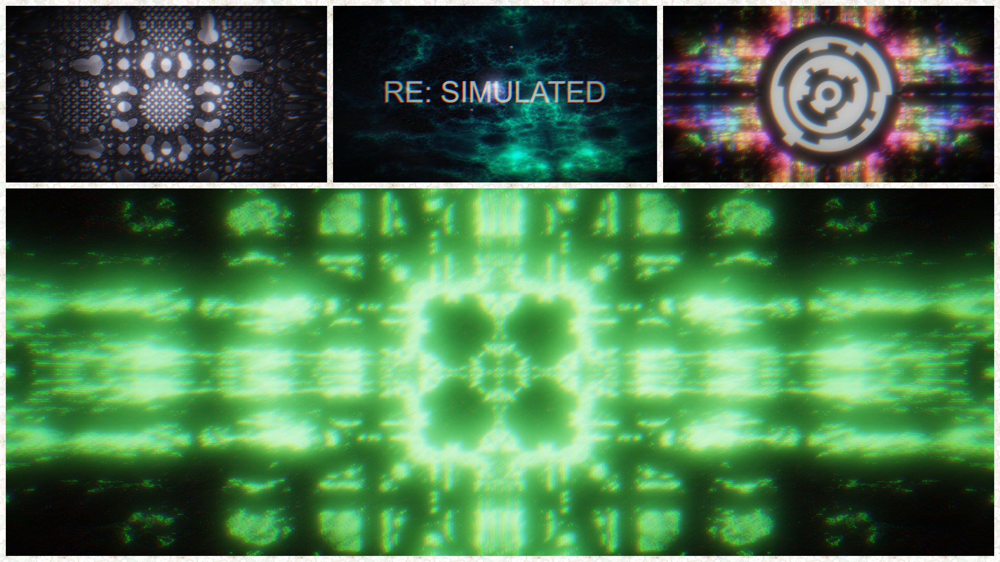

# RE: SIMULATED by gam0022 & sadakkey

RE: SIMULATED by [@gam0022](https://twitter.com/gam0022) (Graphics) & [@sadakkey](https://twitter.com/sadakkey) (Music)

A WebGL 64KB Intro

1st Place [PC 64K Intro](https://2020.revision-party.net/competitions/pc-competitions) at [Revision 2020](https://2020.revision-party.net/start)



## Run

Run in browser on your PC! (only tested latest Chrome)

- [64KB HTML version](https://gam0022.net/webgl/64k-intro_resimulated.html)
- [NEORT version](https://neort.io/art/bqa4pgs3p9f6qoqnmujg)

## Links

- [:tv: YouTube](https://youtu.be/tirAdWbceak)
- [:speech_balloon: Pouet](https://www.pouet.net/prod.php?which=85260)
- [:bird: Twitter](https://twitter.com/gam0022/status/1249658268319768576)

## Development

### 0: Required

- [node.js v12.14.1](https://nodejs.org/ja/) or higher
- [ruby 2.x](https://www.ruby-lang.org/ja/downloads/) or higher

### 1: Get Started

```sh
git clone git@github.com:gam0022/resimulated.git
cd resimulated

# init
npm install

# Start Web server with hot-reload / UI for debug
npm run start

# Generate a dist\resimulated.html
npm run build
```

## Chromatiq

A WebGL engine developed for PC 64K Intro aimed at minimizing the file size.

Written in a single TypeScript, but it's still in development. ([source code](https://github.com/gam0022/resimulated/blob/master/src/chromatiq.ts))

### Features

It has only simple functions so that it does not depend on the work.

- Rendering multi-pass image shaders (as viewport square)
- Build-in bloom post-effect
- Interface to animate uniforms from a TypeScript
- GLSL Sound (Shadertoy compatible)
- Play an Audio file (mp3 / ogg)

### How to Capture Movie

1. `npm run start`
2. misc/saveImageSequence
3. misc/saveSound
4. `ffmpeg.exe -r 60 -i chromatiq%04d.png -i chromatiq.wav -c:v libx264 -preset slow -profile:v high -coder 1 -pix_fmt yuv420p -movflags +faststart -g 30 -bf 2 -c:a aac -b:a 384k -profile:a aac_low -b:v 68M chromatiq_68M.mp4`

#### Links

- [アップロードする動画におすすめのエンコード設定](https://support.google.com/youtube/answer/1722171?hl=ja)
    - 映像ビットレート 2160p（4k）53～68 Mbps
- [YouTube recommended encoding settings on ffmpeg (+ libx264)](https://gist.github.com/mikoim/27e4e0dc64e384adbcb91ff10a2d3678)
- [超有益情報 by sasaki_0222](https://twitter.com/sasaki_0222/status/1248910333835530241)

## Thanks

- [FMS-Cat/until](https://github.com/FMS-Cat/until)
- [gasman/pnginator.rb](https://gist.github.com/gasman/2560551)
- [VEDA 2.4: GLSLで音楽を演奏できるようになったぞ！！！ - マルシテイア by amagitakayosi](https://blog.amagi.dev/entry/veda-sound)
- [[webgl2]example for webgl2 (with glsl3) by bellbind](https://gist.github.com/bellbind/8c98bb86cfd064d944312b09b98af1b9)
- [How to Convert an AudioBuffer to an Audio File with JavaScript by Russell Good](https://www.russellgood.com/how-to-convert-audiobuffer-to-audio-file/)
- [wgld.org by h_doxas](https://wgld.org/)

## License

[MIT](LICENSE)